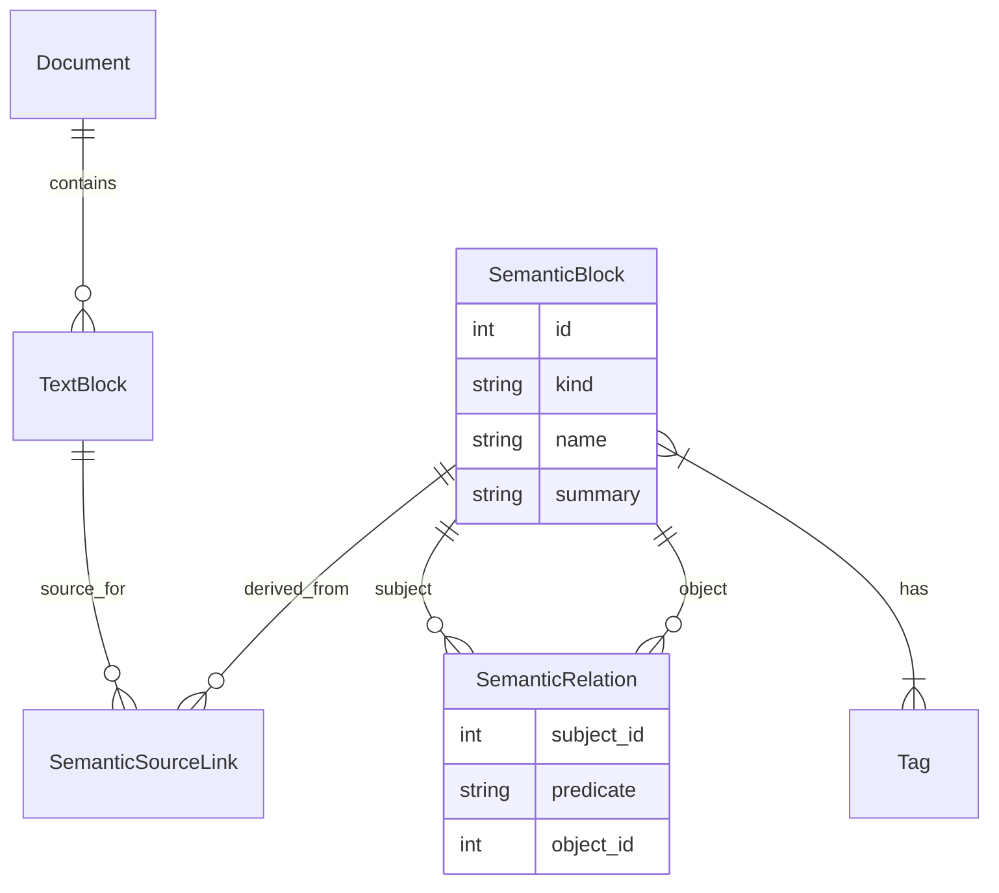

# Database Schema Documentation

This document describes the database schema used in `math-anki` to store semantic analysis results.

## Overview

The database is designed to store:
1.  **Documents**: The source PDF/Markdown files.
2.  **Text Blocks**: The raw segments of text from the documents.
3.  **Semantic Blocks**: The extracted mathematical concepts (Theorems, Definitions, etc.).
4.  **Relationships**: Links between blocks (e.g., Theorem X uses Definition Y).
5.  **Math Objects**: Higher-level entities representing mathematical concepts.

## Core Models

### 1. Document (`document`)
Represents a source file (PDF or Markdown).

| Field | Type | Description |
|-------|------|-------------|
| `id` | Integer | Primary Key |
| `title` | String | Document title |
| `source_path` | String | Path to original PDF |
| `md_path` | String | Path to generated Markdown |
| `source_hash` | String | Hash of the source file for change detection |
| `language` | String | Language code (e.g., "fr") |

### 2. TextBlock (`text_block`)
Represents a raw segment of text from the document (e.g., a paragraph, a theorem statement).

| Field | Type | Description |
|-------|------|-------------|
| `id` | Integer | Primary Key |
| `document_id` | FK | Link to Document |
| `raw_text` | Text | Original text content |
| `normalized_text` | Text | Cleaned/validated text |
| `block_type_hint` | String | Hint from regex segmenter (e.g., "theorem") |
| `page_number` | Integer | Page number in PDF |

### 3. SemanticBlock (`semantic_block`)
Represents a semantic unit of knowledge (Theorem, Definition, Proof, etc.).

| Field | Type | Description |
|-------|------|-------------|
| `id` | Integer | Primary Key |
| `kind` | Enum | Type of block (`theorem`, `definition`, `proof`, etc.) |
| `name` | String | Name of the concept (e.g., "Théorème de Pythagore") |
| `summary` | Text | Concise summary or statement |
| `tags` | M2M | Domain tags (e.g., "geometry", "algebra") |

**Key Relationships:**
- **Sources**: Links to `TextBlock`s that define this semantic block.
- **Relations**: Links to other `SemanticBlock`s (e.g., `proves`, `uses`).
- **Structure**:
    - `statement_id`: Link to the block containing the statement.
    - `hypotheses_id`: Link to the block containing hypotheses.
    - `conclusion_id`: Link to the block containing the conclusion.

### 4. SemanticRelation (`semantic_relation`)
Represents a directed relationship between two semantic blocks.

| Field | Type | Description |
|-------|------|-------------|
| `subject_id` | FK | Source block |
| `predicate` | Enum | Type of relation (`proves`, `uses`, `refers_to`) |
| `object_id` | FK | Target block |

### 5. SemanticSourceLink (`semantic_source_link`)
Links a `SemanticBlock` to the `TextBlock`(s) it was extracted from.

| Field | Type | Description |
|-------|------|-------------|
| `semantic_block_id` | FK | The semantic concept |
| `text_block_id` | FK | The raw text |
| `role` | Enum | Role of the text (`full`, `statement`, `proof`) |

## Enums

### BlockKind
- `definition`, `theorem`, `lemma`, `proposition`, `corollary`
- `proof`, `example`, `exercise`, `remark`

### RelationPredicate
- `proves`: Proof → Theorem
- `uses`: Theorem → Definition
- `refers_to`: General reference
- `depends_on`: Logical dependency

## Diagram

